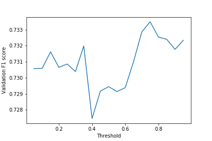

# Final report
Project for course Deep Learning
University of Helsinki
Spring 2020

**Group name**: The Three Caballeros

**Group members**: Mikko Kotola, Eeva-Maria Laiho, Aki Rehn

**Chosen dataset**: Images

*To be removed: mandatory content of the report (from instructions)*
* Approaches and parameters the group tried
* What worked well and what did not
* Error analysis: present some representative examples, with possible explanations about what does not work and how it could be made to work better

## Short description of the final model and training process
*This will likely be a transfer learning model.*

### Preprocessing
* Read in images and labels so that we could attach a one-hot encoded vector of labels to each image
* Also used images with no labels (n=9824 out of 20000)
* Used train-validation-test split of 0.6-0.2-0.2
* Transformations applied to all data sets
    * Normalized images using the means and stds of the RGB channels computed over the given image set
    * NOT CURRENTLY RESIZING: (Resized images to 224x224 to enable using transfer learning models)
* Random data augmentation applied to train set images only
    * Random flipping, affine transformations, rotation, colorjitter and grayscaling
* Calculated pos\_weights (to be used with BCEWithLogitsLoss) for all labels using function calculate\_label\_statistics

### Training
* BCEWithLogitsLoss as the loss function. 
    * Used the pos\_weight parameter to control the label imbalance in the training data.
* Stochastic gradient descent as the training algorithm
* Batch size 64
* Learning rate: using one-cycle-policy 
* Dropout: NOT CURRENTLY USING DROPOUT
    * p=0.5 after the 1st linear layer, p=0.2 after other linear layer(s)

### Evaluation
* We used **f1 scores** to evaluate models
    * with **'micro' averaging**, where each sample-class pair is given an equal contribution to the overall metric
* Thresholds

    We searched for the optimal threshold by scanning the from 0.05 to 1.0 with 0.05 steps and chose the threshold that led to maximum validation f1 score.

    For example, here we would choose 0.70 as the threshold.

    

### Functions and parts of final code
* Data loading
* Visualizing predictions
* Training
* Evaluation of model
* Visualizing confusion matrices for each class

## Final F1-score of the group’s model: xxx

## Other approaches and parameters the group tried

*Let’s describe along with the approach or set of parameters how well it worked.*

### Loading images

Tried ImageFolder for loading images. Noticed that it does not really work for multilabel classification (would work for multiclass single-label classification). After that used adopted the vector of labels per image approach.

### Network type, structure and parameters

#### Simple feedforward network

#### Self-trained convolutional neural networks

#### Transfer learning models

##### VGG16

* replaced fully connected with two linear layers 4096->2048 and 2048->14 and trained all the layers
* validation f1 score of 0.71

##### VGG16 with batch normalization

* for some unknown reason VGG16 with batch normalization gave worse results than plain VGG16 so we did not perform more testing with it.

##### ResNet-101

ResNet-101 was the first ResNet that started to validation f1 score that we were happy with and so we decided to forget about ResNet-34 and ResNet-50.

* replaced output layer with two linear layers 2048->14 and trained all the layers
* validation f1 score of 0.73

##### ResNet-152

TBD

## Optimization

As SGD is known to generalize better than it's adaptive variations we decided to use SGD for optimization. The optimization was done using SGD with Momentum and SGD with Nesterov Momentum.

First we did manual training for few epochs, reduced the learning rate and trained with more epochs. With a lot of work achieved a validation accuracy of ~0.73 using this method.

This turned out to be labor intensive so instead we switched to use One Cycle Policy (https://arxiv.org/abs/1708.07120). Now, without the manual labor, we managed to reach the same ~0.73 validaton f1 score with One Cycle Policy.

## Other notes
* Labels in the training set are not independent. E.g male and female photos are always also people photos. It's important to train the model with all labels for a certain image so that it can learn from these dependencies.

## Error analysis
Representative examples, with possible explanations about what does not work and how it could be made to work better.

- Difference between male and female labels is in some cases hard to tell (for the network, but also for human observers)
