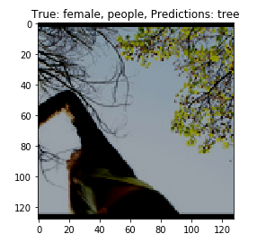
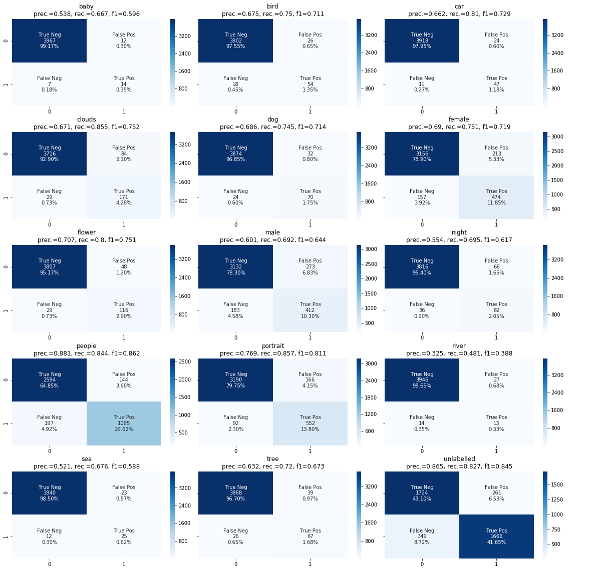

# Final report
Project for course Deep Learning
University of Helsinki
Spring 2020

**Group name**: The Three Caballeros

**Group members**: Mikko Kotola, Eeva-Maria Laiho, Aki Rehn

**Chosen dataset**: Images

## Final F1-score of the group’s model on the test set: xxx

WE DIDN't GET THE true_labels.txt FILE, DID WE?

Final predictions: [Predictions on actual test set using the final model](../results/resnet152_final_actual_pred.txt)

## Short description of the final model and training process
### Model: Resnet-152
Our best-performing model was a deep pretrained convolutional neural network with residual connections. We froze all layers but the final layer, which we replaced with our own 2048->14 fully connected layer, which we trained. Our final F1-score on own test data was 0.78 (micro averaging). 

Our final model is constructed so that we first trained for 25 epochs on our train data. We then continued training the model on our validation data and test data for 1 epoch each. Evaluation of model performance is done before the last two epochs.

### Preprocessing
* Read in images and labels so that we could attach a one-hot encoded vector of labels to each image
* Also used **images with no labels** (n=9824 out of 20000)
* Used **train-validation-test split** of 0.6-0.2-0.2
* **Normalized images** using the means and stds of the RGB channels computed over the given image set
* **Random data augmentation** applied to train set images only: we used random horizontal flipping, rotation, colorjitter, grayscaling and perspective changes.
* Calculated **pos\_weights** (to be used with BCEWithLogitsLoss) for all labels to compensate the label imbalance

### Training
* BCEWithLogitsLoss as the **loss function**. We Used the pos\_weight parameter to control the label imbalance in the training data.
* Stochastic gradient descent as the **training algorithm**
* **Batch size** 64
* **Learning rate**: using one-cycle-policy 
* **25 epochs**: the validation accuracy had leveled off at this point and the validation loss was already rising, so we opted for early stopping after 25 epochs.


### Evaluation
* We used **f1 scores** to evaluate models with **'micro' averaging**, where each sample-class pair is given an equal contribution to the overall metric. We also considered the 'macro' averaging, which could have been appropriate if the label frequencies in the test set would have been different from training data. But our understanding was that the test set would be similar to the training set also in this aspect (and 'micro' seemed to be used in the test_eval.py script), so we stuck with 'micro'.
* **Thresholds.** We searched for the optimal threshold by scanning the from 0.05 to 1.0 with 0.05 steps and chose the threshold that led to maximum validation f1 score. Our model gave best results with the threshold of 0.65.


### Functions and parts of final code
* Data loading
* Visualizing predictions
* Training
* Evaluation of model
* Visualizing confusion matrices for each class
 

## Other approaches and parameters the group tried

### Loading images

Tried ImageFolder for loading images. Noticed that it does not really work for multilabel classification (would work for multiclass single-label classification). After that used adopted the vector of labels per image approach.

### Network type, structure and parameters

Evaluation metrocs (```F1-score```, ```Precision```, ```Recall```) for each model evauated against our own test set are listed below under heading 'Evaluation of different approaches'.

#### Simple feedforward network
We first ran simple one and two layer feedforward neural networks (with fully connected layers and ReLu activations) to see that our pipeline works. 

#### Self-trained convolutional neural networks
We built a few convolutional models from scratch: one simple one and one following the structure of the VGG16. The results were not impressive and we knew these models would require much more training data than we had to perform well, so we quite quickly moved to transfer learning. 

#### Transfer learning models

##### VGG16
VGG16 was the first transfer learning model we tried.

* replaced fully connected with two linear layers 4096->2048 and 2048->14 and trained all the layers

##### VGG16 with batch normalization
For some unknown reason VGG16 with batch normalization gave worse results than plain VGG16 so we did not perform more testing with it.

##### ResNet-101
ResNet-101 was the first ResNet that started to validation f1 score that we were happy with and so we decided to forget about ResNet-34 and ResNet-50.

* replaced output layer with two linear layers 2048->14 and trained all the layers

##### ResNet-152
This was the model that we got best results with. Described in more detail under *Short description of the final model and training process*.

## Evaluation of different approaches

Below are listed the results (```F1-score```, ```Precision```, ```Recall```) of running the ```test_eval.py``` script for each trained model against our own test set (20% of the initial data). In the results we list also ```Ratio of F1``` for each model. We used ```Ratio of F1``` as a measure of overfitting and it was computed as a ratio of training and validation F1-scores after epoch 25. 

All the models have been trained on our own training set (60% of the initial data). The models are trained for 25 epochs using a batch size of 64. For all models we use ```BCEWithLogitsLoss``` loss function, ```SGD``` optimizer and ```OneCycle``` scheduler (documented in detail above).

Results for models that utilize data augmentation techniques.

| Model | F1-score | Precision | Recall | Ratio of F1 | Training time |
| --- | --- | --- | --- | --- | --- | 
| Feed forward 1-layer | 0.245 | 0.191 | 0.341 | 0.881 | 22min 57s | 
| Feed forward 2-layer | 0.269 | 0.206 | 0.387 | 0.989 | 24min 9s | 
| Convolutional | 0.145 | 0.118 | 0.186 | 0.879 | 26min 55s | 
| Plain ResNet-152 | 0.180 | 0.126 | 0.317 | - | - | 

Results for models that utilize transfer learning and data augmentation techniques.

| Model | F1-score | Precision | Recall | Ratio of F1 | Training time | 
| --- | --- | --- | --- | --- | --- | 
| VGG16 | 0.700 | 0.626 | 0.794 | 1.014 | 27min 29s |   
| VGG16 with BN | 0.669 | 0.565 | 0.820 | 0.967 |  27min 44s | 
| ResNet-34 | 0.726 | 0.684 | 0.774 | 1.137 | 27min 36s | 
| ResNet-50 | 0.749 | 0.727 | 0.773 | 1.161 | 29min 29s | 
| ResNet-101 | 0.745 | 0.718 | 0.773 | 1.168 | 36min 57s | 
| ResNet-152 | 0.759 | 0.729 | 0.791 | 1.161 | 42min 22s | 

Results for models that utilize transfer learning (without data augmentation).

| Model | F1-score | Precision | Recall | Ratio of F1 | Training time |
| --- | --- | --- | --- | --- | --- | 
| ResNet-50 no aug | 0.751 | 0.783 | 0.722 | 1.350 | 14min 4s | 
| ResNet-50 no aug with dropout | 0.760 | 0.783 | 0.739 | 1.344 | 13min 51s | 


## Optimization
As SGD is known to generalize better than it's adaptive variations we decided to use SGD for optimization. The optimization was done using SGD with Momentum and SGD with Nesterov Momentum.

First we did manual training for few epochs, reduced the learning rate and trained with more epochs. With a lot of work achieved a validation accuracy of ~0.73 using this method.

This turned out to be labor intensive so instead we switched to use One Cycle Policy (https://arxiv.org/abs/1708.07120). Now, without the manual labor, we managed to reach the same ~0.73 validaton f1 score with One Cycle Policy. Later, with a larger model, we were able to reach a 0.76 validation f1 score (without manual labor).


## Other notes
* Labels in the training set are not all independent. E.g male, female and baby photos are very often also people photos. It's important to train the model with all labels for a certain image so that it can learn from these dependencies.


## Error analysis
The labels with the lowest f1 scores were river (0.33), sea (0.54) and baby (0.65). The precision and recall components were quite close to each other for all other classes but *sea* (precision 0.70, recall 0.43), which would suggest that using class-specific thresholds would not give any significant improvement for any classes but perhaps sea. For sea, the precision score is higher than the recall score, so lowering the threshold might improve the performance. 

### Error types and representative examples


- **Can't make difference between labels male and female.** Discriminating between males and females is in some cases very hard (for the network, but also for human observers) as the appearance of males and females is in some cases almost identical. The f1 score of people (0.88) was much higher than for female (0.75) and male (0.67). This error is hard to improve on.


- **Same person is male and female.** In some cases the model thinks the same person is both male and female. This is an error that a human observer would likely not make: people are almost never *both* sexes. And this is something the network should be able to learn (but that might be hard to learn for a convolutional network like ours).
- **Difference between baby and a small child is fuzzy.** The label baby (f1 0.65) was quite difficult for the model: the easy part in identifying babies was presumably identifying them as humans and the difficulty was drawing the line between baby and child (a small human that is no longer a baby). This line is fuzzy for human observers also, so the tags will most likely be somewhat incoherent. The example above is labeled as a baby, but many human observers would say "He's not a baby anymore!".


- **Untypical images of parts.** Is a picture of knuckles (of a person) a picture of a person? This relation of a part to the whole is ambiguous for human labelers, so the labeler of the sample image has decided not to label it as people or male even though the picture surely displays a part of a human, most likely a male. The model could learn to associate pictures of parts with the label of the whole if it had enough systematically labeled training data. Here the problem has most likely been that scarceness of these atypical images of parts and the unsystematic labeling by humans (as there might not be a consensus how to treat the part images).


- **Main subject of the image.** Sometimes the image has some objects in the foreground and some objects in the background. Is the image an image about only the foreground objects or also about the background objects? Some human labelers might be inclined to label only the foreground objects and disregard the background objects as unessential. This sample definitely depicts a tree, but the main object is a human in the foreground.


- **Difficult labels: river**. The label 'river' is difficult for both the model and a human. Labeling 'water' would be a bit easier, but if there is water in the picture, is it a part of a river or a part of a lake or a sea? This is ambiguous also for humans. In some cases *domain knowledge* does give the answer (as in one of the samples above): if there is a bridge over water with lamps on it, it's almost always a river flowing underneath. With enough training data, the model could learn this.


- **Difficult labels: sea**. The label 'sea' is difficult for both the model and a human for the same reasons as 'river': there is water, but is it a river, lake, a sea or an ocean? It is hard to improve on this error, as the concepts are hard to tell apart in 2-dimensional pictures of parts of the bodies of water. *Color* is also an important feature here: the seas are pretty much always blue. In theory a deep resnet model with residual connections should be able to exploit the color aspect of the image, so maybe more training data could improve this.


- **Obviously wrong labels**. The labels have been given by humans (on Amazon mechanical turk or some other similar service). Humans make mistakes. So sometimes the model predicts something that seems more right than the ground truth. The only way to improve this is to get better quality training data.


### Per label performance

To assess our model's per-label performance we computed a by-label classification report on our own testset (20% of the given dataset):

```
              precision    recall  f1-score   support

           0       0.54      0.67      0.60        21
           1       0.68      0.75      0.71        72
           2       0.66      0.81      0.73        58
           3       0.67      0.85      0.75       200
           4       0.69      0.74      0.71        94
           5       0.69      0.75      0.72       631
           6       0.71      0.80      0.75       145
           7       0.60      0.69      0.64       595
           8       0.55      0.69      0.62       118
           9       0.88      0.84      0.86      1262
          10       0.77      0.86      0.81       644
          11       0.33      0.48      0.39        27
          12       0.52      0.68      0.59        37
          13       0.63      0.72      0.67        93

   micro avg       0.73      0.79      0.76      3997
   macro avg       0.64      0.74      0.68      3997
weighted avg       0.74      0.79      0.76      3997
 samples avg       0.37      0.38      0.37      3997
```

We also evaluated our model's by-label performance by plotting a confusion matrix of the classification report data. In the confusion matrix we also assess our model's performance on non-labelled images. 




